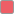
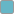
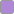
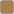
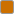

<h1 align="center">pastelhash.nvim</h1>
<p align="center">clear focus on what matters</p>
<p align="center">
  
</p>

## Palette

<table align="center">
  <thead>
    <tr>
      <th align="center">Token</th>
      <th align="center">Light</th>
      <th align="center">Dark</th>
    </tr>
  </thead>
  <tbody>
    <tr>
      <td align="center"><code>bg</code></td>
      <td align="center">
        
        <code>#F7F7FF</code>
      </td>
      <td align="center">
        
        <code>#252530</code>
      </td>
    </tr>
    <tr>
      <td align="center"><code>fg</code></td>
      <td align="center">
        
        <code>#3F3F53</code>
      </td>
      <td align="center">
        
        <code>#BDBDD9</code>
      </td>
    </tr>
    <tr>
      <td align="center"><code>bg-alt</code></td>
      <td align="center">
        
        <code>#EEEEFC</code>
      </td>
      <td align="center">
        
        <code>#202025</code>
      </td>
    </tr>
    <tr>
      <td align="center"><code>error</code></td>
      <td colspan="2" align="center">
        
        <code>#EE5E66</code>
      </td>
    </tr>
    <tr>
      <td align="center"><code>warning</code></td>
      <td colspan="2" align="center">
        
        <code>#FABD2F</code>
      </td>
    </tr>
    <tr>
      <td align="center"><code>ok</code></td>
      <td colspan="2" align="center">
        
        <code>#79C779</code>
      </td>
    </tr>
    <tr>
      <td align="center"><code>info</code></td>
      <td colspan="2" align="center">
        
        <code>#66AFEF</code>
      </td>
    </tr>
    <tr>
      <td align="center"><code>hint</code></td>
      <td colspan="2" align="center">
        
        <code>#66B6C6</code>
      </td>
    </tr>
    <tr>
      <td align="center"><code>comment, delimiter</code></td>
      <td colspan="2" align="center">
        
        <code>#7F879E</code>
      </td>
    </tr>
    <tr>
      <td align="center"><code>literal</code> (<code>String</code>, <code>Number</code>, <code>Boolean</code>, <code>Constant</code>)</td>
      <td colspan="2" align="center">
        
        <code>#88B8FA</code>
      </td>
    </tr>
    <tr>
      <td align="center"><code>decl</code> (first declarations/initializations, imports)</td>
      <td colspan="2" align="center">
        
        <code>#AF87D7</code>
      </td>
    </tr>
    <tr>
      <td align="center"><code>immutable</code> (<code>ReadOnly</code>, when enabled)</td>
      <td colspan="2" align="center">
        
        <code>#AB7F49</code>
      </td>
    </tr>
    <tr>
      <td align="center"><code>keyword</code> (<code>Keyword</code>, <code>Statement</code>, etc., when enabled)</td>
      <td colspan="2" align="center">
        
        <code>#CC7000</code>
      </td>
    </tr>
  </tbody>
</table>

## Configuration and default values

```lua
require('pastelhash').setup({
    variant = nil, -- 'light' | 'dark'; nil -> auto using vim.o.background
    deprecated_as_warn = false, -- true -> deprecated is colored as WARNING
    highlight_immutable = false, -- true -> readonly is colored #AB7F49
    highlight_keywords = false, -- true -> keyword groups are colored #CC7000
})
vim.cmd.colorscheme('pastelhash')
```

Vim:

```vim
" let g:pastelhash_variant = 'light' " or 'dark'; unset -> auto by &background
let g:pastelhash_deprecated_as_warn = 0
let g:pastelhash_highlight_immutable = 0
let g:pastelhash_highlight_keywords = 0
colorscheme pastelhash
```

## Notes

- Vim support is regex-syntax based. Declaration highlighting is best-effort and language dependent.
- Neovim includes extra Treesitter highlight groups when available.
- Expects truecolor (`termguicolors`).
